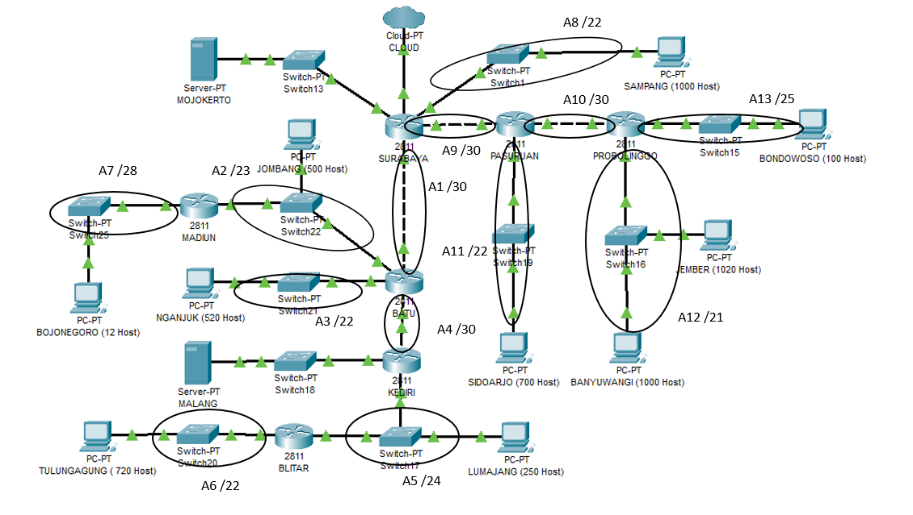
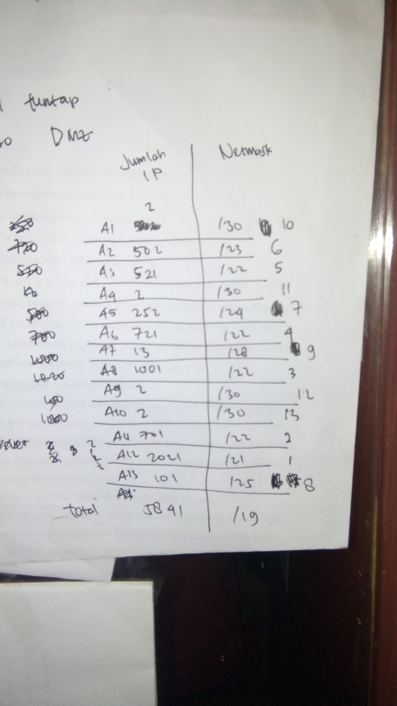
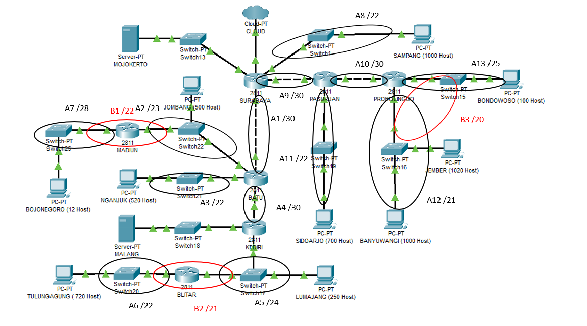

# Jarkom_Modul4_Lapres_A09

Kelompok A09:

    Iman Afandy (05111740000129)
    Nodas Uziel Putra Serpara (5111840007007)

 
 Kami menggunakan CIDR pada CPT dan VLSM pada UML 

 
 # Langkah pengerjaan CIDR 
 
 
 Tentukan subnet pada topologi yang diberikan 
 
 
  
 
 
 Tentukan jumlah alamat ip yang dibutuhkan dan netmask 
 
  
  
  
 
 Gabungkan subnet paling bawah (ujung) pada topologi 
 
 
  
  
  

  

 
 
 
 
 

 Hitung pembagian IP dengan pohon berdasarkan penggabungan subnet yang telah dilakukan. 
 

 
 
 
 Buat topologi pada cisco packet tracer 
 
 
  
 
 
 Atur IP pada tiap interfaces 
 
 
   
  
 
 Atur IP pada client 
 
 
 
   
   
  
 Lakukan routing pada router 
 
  
   
   
 
 
 
 
 
 
 
 
 
 
 
 
